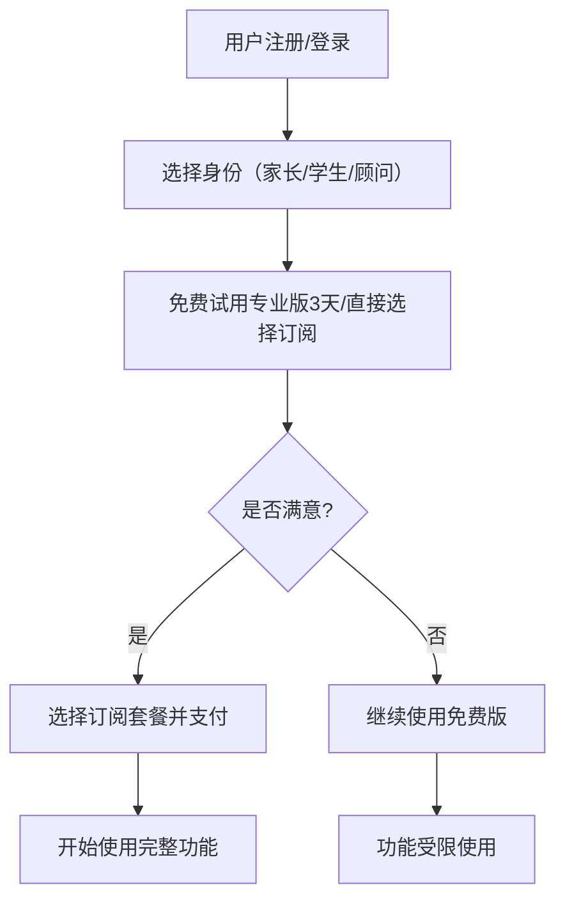

-----

# **🎓 Form.AI 2.0：香港升学表格智能填写平台**

## **产品方案书**

**版本：** 1.0
**日期：** 2025年7月11日
**作者：** [团队名称/作者]

-----

## **0. 执行摘要 (Executive Summary)**

Form.AI 2.0 是一款专为香港中小学升学申请设计的智能表格填写平台。通过融合先进的 AI 技术（OCR、NLP、VLM、RLHF）与人工审核服务，平台旨在解决家长和学生在填写复杂升学表格时面临的耗时、易错、效率低下等痛点。本产品将提供智能识别、信息提取、自动填充、在线编辑、多格式导出及增值升学顾问服务，构建一个“AI+人工”双重保障的智能升学生态系统。我们的目标是成为香港升学申请领域的领先产品，为用户提供高效、准确、便捷的解决方案。

-----

## **1. 产品背景与市场分析**

### **1.1 市场痛点**

  * **耗时费力：** 香港升学表格通常冗长复杂，涉及大量个人、家庭、教育背景信息，手动填写耗时巨大。
  * **易错难校：** 格式要求严格，中英文混杂，手写或录入错误率高，人工校对困难。
  * **信息分散：** 多个表格字段重复，信息需要反复填写或查找。
  * **缺乏专业指导：** 家长对申请流程和表格要求不熟悉，易遗漏关键信息或错过截止日期。
  * **缺乏统一管理：** 家庭成员、升学顾问难以高效协作完成申请。

### **1.2 市场规模与潜力**

  * 香港中小学数量众多，每年有大量新生入学及插班生申请需求。
  * 目标用户群体（中产家庭、追求教育质量的家长）对效率和准确性有高要求，且具备付费意愿。
  * 目前市场上缺乏专注于香港升学场景的智能填表工具，存在显著的市场空白。

### **1.3 竞品分析 (简要回顾)**

  * **通用 OCR/填表工具：** 功能通用，不具备升学领域的特异性，AI 准确率在复杂表格上表现不佳。
  * **人工代填服务：** 效率低，成本高，无法满足海量需求，且用户无法自主掌控流程。
  * **教育咨询机构：** 提供咨询服务，但通常不直接提供智能填表工具，而是人工辅助。

### **1.4 我们的竞争优势**

  * **聚焦香港升学：** 针对性强，能提供专业且本地化的服务。
  * **AI 技术领先：** 结合 OCR、NLP、VLM、RLHF，实现高精度识别、智能信息提取与填充。
  * **模板库完善：** 覆盖香港800+中小学申请表格，持续更新。
  * **AI + 人工双重保障：** 提供专业顾问审核和咨询，建立用户信任。
  * **用户体验优化：** 所见即所得编辑、多语言支持、智能提示，确保高效便捷。

-----

## **2. 产品定位与目标用户**

### **2.1 产品定位**

Form.AI 2.0 是一款专为香港中小学升学申请设计的智能表格填写平台。通过 AI 技术自动识别表格、提取信息、填写内容，并提供人工审核、升学建议等增值服务，帮助家长和学生高效、准确地完成升学申请流程。

### **2.2 目标用户细分**

| 用户类型         | 需求特征                 | 付费能力 | 产品策略                                 |
| :--------------- | :----------------------- | :------- | :--------------------------------------- |
| **家长（核心用户）** | 节省时间、提高准确率、便捷操作 | 中等     | 主推专业版，突出效率和准确性             |
| **学生（辅助用户）** | 操作简单、界面友好、快速完成 | 低       | 免费版引流，培养早期用户习惯             |
| **升学顾问（高价值用户）** | 批量处理、提高效率、定制化、品牌合作 | 高       | 企业版，提供白标、API 接口、批量部署     |
| **学校/教育机构（B端用户）** | 统一标准、数据管理、集成现有系统 | 高       | 企业版，提供 API、定制化部署、数据分析支持 |

-----

## **3. 核心功能模块**

### **3.1 🧠 智能表格识别与填写引擎**

  * **功能亮点：**
      * **多格式上传：** 支持 PDF、图片（PNG/JPG）、扫描件（包括手写内容）上传。
      * **高精度智能识别：** 基于 OCR + NLP 自动识别表格字段及其类型。
      * **自然语言信息提取：** 用户输入自然语言描述（中文简繁/英文），AI 自动从中提取姓名、日期、地址、电话、教育背景、职业等关键信息。
      * **智能字段匹配与填充：** AI 根据语义理解，将提取的信息精准匹配到表格相应字段，并按要求格式化填充。支持多对一、一对多复杂映射。
      * **多语言支持：** 全面支持中文简体、中文繁体、英文的识别、提取、填写与翻译。用户可选择界面语言及输入/输出语言。
      * **上下文理解与推理：** 结合表格逻辑和用户提供的信息，进行智能推理和条件填充（如：根据“是否残疾”勾选后续字段）。
      * **AI 置信度提示：** 对于 AI 填充结果，尤其是置信度较低的字段，界面上进行高亮提示或显示置信度分数，引导用户重点校对。
  * **技术实现（强化版）：**
      * **OCR (Optical Character Recognition)：**
          * [cite\_start]**基础引擎：** PaddleOCR (结合自训练模型) [cite: 59, 61, 65, 68, 84]。
          * **增强识别：** 结合 NVIDIA Llama Nemotron Nano VL 或 Google Gemini/GPT-4o 等多模态视觉语言模型 (VLM) API，提升对复杂布局、多语言、手写体、低质量扫描件的识别精度和语义理解能力。
      * **NLP (Natural Language Processing)：**
          * **LLM 深度应用：** 基于 GPT-4o / Gemini Advanced / Llama 3 等大型语言模型进行语义理解、信息提取（NER, RE）和意图识别。
          * **领域微调：** 针对香港升学申请特定术语、表达方式，通过大量相关文本对 LLM 进行领域微调或 RAG 增强。
          * **自定义 NER 模型：** 训练识别香港特有实体（如学籍编号、学校代号、特定奖项名称）的定制化模型。
      * [cite\_start]**表格结构识别：** LayoutLMv3 [cite: 59, 61, 65, 68, 84]。
      * **智能匹配与填充：**
          * **基于 Embedding 的语义匹配：** 将表格字段描述和用户提取信息转化为向量，通过相似度匹配。
          * **知识图谱：** 构建香港升学相关概念、实体、关系的知识图谱，辅助精确映射。
          * **RLHF (Reinforcement Learning from Human Feedback)：** 通过收集用户修正（显式纠正）和确认（隐式确认）数据，训练奖励模型，并用强化学习算法优化 AI 模型的填充策略，使其行为更符合人类偏好，减少用户修正次数。
      * [cite\_start]**数据标准化与校验：** 按照字段类型和表格要求进行数据格式化（如日期 DD/MM/YYYY [cite: 21, 24][cite\_start]、电话号码格式 [cite: 41]）和基础校验。

### **3.2 📚 香港升学表格模板库**

  * **功能亮点：**
      * **海量覆盖：** 覆盖香港 800+ 中小学申请表格，持续更新。
      * [cite\_start]**精细分类：** 按学校（名称/区域）、年级、申请类型（插班生 [cite: 2, 4]、新生）、申请截止日期等分类。
      * **智能搜索与筛选：** 支持关键词搜索、多维度筛选、快速收藏常用模板。
      * **模板版本管理：** 自动跟踪学校表格更新，并通知用户，确保使用最新版本。
      * **用户贡献与激励：** 鼓励用户上传新模板或更新模板，并提供积分/奖励机制。
      * **智能预检（规划中）：** 基于用户申请目标，智能推荐所需表格清单及所需附件材料。
  * **数据来源：**
      * 公开渠道收集（学校官网、教育局等）
      * 用户上传共享
      * 学校合作提供（优先获取最新模板）

### **3.3 ✍️ 在线表格编辑器**

  * **功能亮点：**
      * **所见即所得 (WYSIWYG) 编辑体验：** 用户可在表格预览界面直接点击高亮区域进行修改，实时看到效果。
      * **多语言输入：** 支持在同一字段内输入中文简繁和英文。
      * **多种字段类型支持：** 文本、数字、日期、选择框（单选/多选）、勾选框、下拉列表等。
      * **富文本编辑：** 支持部分字段进行简单的格式设置（如加粗、斜体）。
      * **实时保存与版本回溯：** 自动保存填写进度，并支持查看和恢复历史版本。
      * [cite\_start]**多媒体插入：** 支持上传证件照 [cite: 1]、附件等。
      * [cite\_start]**手写签名模拟：** 提供手写板功能，或支持上传签名图片，插入到签名区域 [cite: 84]。
      * **多人协作编辑：** （家庭版/企业版）支持多个成员共享和同时编辑同一份表格，实时同步。

### **3.4 📤 多格式导出与打印**

  * **支持格式：**
      * **PDF (高清打印版)：** 生成与原表格高度一致、可直接打印的 PDF 文件。
      * **图片 (PNG/JPG)：** 用于在线提交或分享。
      * **直接打印：** 连接打印机，一键打印。
      * **分享链接：** 生成带有密码保护和/或有效期限制的表格分享链接。

### **3.5 🧑‍🏫 升学顾问服务 (增值服务)**

  * **服务内容：**
      * [cite\_start]**AI 升学报告：** 基于用户填写内容（如教育背景 [cite: 59][cite\_start], 申请成就 [cite: 62]），结合大数据分析，生成个性化申请建议和学校匹配度分析报告。
      * **人工审核服务：** 专业升学顾问人工审核已填写的表格内容，确保语法、格式、逻辑的准确无误，并提供修改建议。
      * **升学规划咨询：** 一对一视频/电话咨询服务，提供个性化升学路径规划、面试指导、文书润色等（限时优惠）。
      * **数据分析洞察：** （企业版）为学校/机构提供申请数据分析报告，优化招生策略。

-----

## **4. 产品版本与收费模型**

| 版本     | 月费      | 年费优惠      | 核心功能                                     | 目标用户           |
| :------- | :-------- | :------------ | :------------------------------------------- | :----------------- |
| **免费版** | HKD 0     | -             | 每月 2 次填写、预览、基础模板、受限导出      | 学生、试用用户     |
| **基础版** | HKD 128   | HKD 1,280     | 每月 10 次填写、PDF 导出、基础模板、历史版本 | 轻度使用家长       |
| **专业版** | HKD 298   | HKD 2,980     | 无限填写、高级模板、50个自定义模板、AI 升学报告（摘要） | 核心家长用户       |
| **家庭版** | HKD 498   | HKD 4,980     | 专业版所有功能 + 3人共享 + 升学顾问咨询1次/月 + 人工审核服务（1次/月） | 多子女家庭         |
| **企业版** | 面议      | -             | 白标定制、API 接口、批量处理、定制部署、数据分析、专属顾问支持 | 教育机构、学校、升学顾问 |

-----

## **5. 用户流程**

### **5.1 首次使用流程**



### **5.2 表格填写流程（强化版）**

```mermaid
graph TD
    A[选择/上传表格模板] --> B[选择信息输入方式 (自然语言输入/手动输入/导入历史信息)]
    B -- 用户提供信息 --> C[AI智能信息提取 (NLP)]
    C -- 提取结构化数据 --> D[AI智能字段匹配与填充 (VLM + IE + KG + RLHF)]
    D -- 填充结果/置信度提示 --> E[用户预览与智能提示 (UI)]
    E --> F{需要修改/确认?}
    F -- 否 (确认无误) --> G[导出PDF/打印/提交]
    F -- 是 (修正/补充) --> H[用户手动编辑/再次自然语言输入修正]
    H -- 用户反馈数据 --> I[RLHF奖励模型优化 AI]
    I -- 优化后模型 --> D -- 再次填充 --> E
```

-----

## **6. 技术架构**

### **6.1 系统架构图**

```mermaid
graph TB
    subgraph "用户端 (Frontend)"
        A[Web App (React/Vue.js)]
        B[Mobile App (iOS/Android - React Native)]
    end
    
    subgraph "API网关 (API Gateway)"
        C[API Gateway (Nginx/Kong)]
    end
    
    subgraph "核心服务 (Backend Services - Microservices)"
        D[用户与权限管理 (User Service)]
        E[模板管理服务 (Template Service)]
        F[AI 引擎服务 (AI Core Service)]
        G[支付与订阅管理 (Payment/Subscription Service)]
        H[文件处理与存储 (File Service)]
        I[通知与消息服务 (Notification Service)]
        J[日志与监控 (Logging/Monitoring)]
    end
    
    subgraph "AI 能力层 (AI Capabilities)"
        K[OCR 识别 (PaddleOCR/VLM API)]
        L[NLP 处理 (LLM API/Fine-tuned Models)]
        M[表格结构识别 (LayoutLMv3)]
        N[语义匹配与填充 (Embedding/KG)]
        O[RLHF 奖励模型 (Reward Model)]
    end
    
    subgraph "数据存储 (Data Stores)"
        P[用户数据 DB (PostgreSQL/MongoDB)]
        Q[模板库 DB (PostgreSQL)]
        R[文件存储 (Cloud Object Storage - e.g., S3/OSS)]
        S[用户反馈数据 DB (NoSQL - for raw/structured feedback)]
        T[知识图谱 DB (Graph DB - e.g., Neo4j)]
        U[向量数据库 (Vector DB - for Embeddings)]
    end
    
    subgraph "外部集成 (External Integrations)"
        V[支付网关 (Stripe/Alipay/WeChat Pay)]
        W[云服务商 AI APIs (Google Gemini/GPT-4o/NVIDIA Nano VL)]
        X[短信/邮件服务 (Twilio/SendGrid)]
    end
    
    A -- RESTful API --> C
    B -- RESTful API --> C
    C --> D & E & F & G & H & I
    F --> K & L & M & N & O
    D --> P
    E --> Q
    H --> R
    I --> X
    G --> V
    K & L & M & N & O --> W (for external LLM/VLM APIs)
    F --> S (Write Feedback Data)
    S <-- Analytics & Annotators
    F --> T (Read/Write Knowledge Graph)
    F --> U (Read/Write Embeddings)
```

### **6.2 关键技术栈**

  * **后端：** Python (Flask/Django/FastAPI) / Go (for high-performance services)
  * **前端：** React/Vue.js (Web), React Native (Mobile)
  * **数据库：** PostgreSQL (关系型数据), MongoDB (非关系型数据，用于用户反馈), Neo4j (知识图谱), Milvus/Pinecone (向量数据库)
  * **AI/ML 框架：** PyTorch / TensorFlow
  * **云平台：** AWS / Azure / Google Cloud Platform (取决于成本、合规性和现有技术栈偏好)
  * **容器化：** Docker, Kubernetes (用于微服务部署和管理)
  * **CI/CD：** GitHub Actions / GitLab CI / Jenkins
  * **监控：** Prometheus, Grafana

-----

## **7. 运营策略**

### **7.1 用户获取 (Acquisition)**

  * **SEO 优化：** 针对“香港升学表格”、“中学入学申请”、“插班生申请表”等高频关键词进行搜索引擎优化。
  * **内容营销：** 撰写高质量升学攻略、表格填写指南、学校介绍、成功案例分享，发布在官网博客、知乎、小红书、微信公众号等平台。
  * **社交媒体推广：** 在香港本地家长社群（Facebook Group、WhatsApp 群组）、教育类KOL合作、小红书等平台进行精准投放和互动。
  * **KOL/KOC 合作：** 与知名教育博主、升学顾问合作，进行产品评测和推荐。
  * **合作推广：** 与香港本地教育机构、补习社、升学咨询机构建立合作关系，捆绑销售或交叉推广。
  * **线下活动：** 参加教育展、学校开放日、举办升学讲座，进行现场演示和推广。

### **7.2 用户留存 (Retention)**

  * **新手引导：** 提供交互式产品教程、视频演示、FAQs，帮助用户快速熟悉平台。
  * **使用提醒与个性化推送：**
      * 表格更新提醒（订阅的学校模板有更新）。
      * 申请截止日期提醒。
      * 根据用户进度，推送个性化升学建议或下一步操作指引。
  * **社区建设：** 建立在线家长交流社区、问答平台，鼓励用户分享经验、互相帮助，提升平台粘性。
  * **积分与奖励体系：** 用户完成表格、邀请好友、分享经验、贡献模板等行为可获得积分，积分可兑换增值服务、优惠券。
  * **客户支持：** 提供及时、专业的在线客服和技术支持。

### **7.3 用户转化 (Monetization)**

  * **免费试用策略：** 提供专业版功能 3 天免费试用，让用户充分体验 AI 核心价值。
  * **限时优惠与节日促销：** 在升学季、节假日等关键时间点推出折扣活动，刺激付费转化。
  * **推荐奖励计划：** 推荐好友成功付费，推荐人和被推荐人均可获得奖励（如会员时长、填写次数）。
  * **功能限制提醒：** 免费版用户达到使用上限时，弹出明确的升级提示和功能对比，引导用户升级。
  * **多版本差异化营销：** 针对不同目标用户群，突出各版本对应解决的痛点和带来的价值。

-----

## **8. 财务预测 (三年)**

| 年份 | 用户数 (付费+免费) | 年收入 (HKD) | 年成本 (HKD) | 净利润 (HKD) | 利润率 |
| :--- | :----------------- | :----------- | :----------- | :----------- | :----- |
| 第1年 | 2,000              | 8.6M         | 5.5M         | 3.1M         | 36%    |
| 第2年 | 5,000              | 21.5M        | 8.2M         | 13.3M        | 62%    |
| 第3年 | 10,000             | 43M          | 12.5M        | 30.5M        | 71%    |

  * **关键假设：**
      * 用户增长率：基于市场推广和口碑效应的复合增长。
      * ARPU (Average Revenue Per User)：基于各版本订阅比例的加权平均值。
      * 成本构成：主要包括研发（人力、AI API 调用费）、市场营销、运营、服务器和人工标注团队成本。

-----

## **9. 风险与应对**

| 风险类型 | 具体风险                 | 应对策略                                                                                                                                                                                                                                                                                                                                                                                     |
| :------- | :----------------------- | :----------------------------------------------------------------------------------------------------------------------------------------------------------------------------------------------------------------------------------------------------------------------------------------------------------------------------------------------------------------------------------- |
| **技术风险** | AI 识别/填充准确率不足 | **持续优化模型：** 通过 RLHF、监督学习和领域微调不断提升 OCR、NLP 和匹配算法的准确率。建立高效的用户反馈机制，将用户纠正转化为训练数据。**人工兜底：** 结合人工审核服务作为最终保障，弥补 AI 的不足。**技术选型灵活：** 持续关注 AI 技术前沿，适时引入更强大的基础模型或工具。                                                                                                    |
| **市场风险** | 市场接受度低/用户习惯难改变 | **深入用户调研：** 持续进行用户访谈，了解真实痛点和需求，快速迭代产品。**价值主张清晰：** 市场推广着重强调节省时间、提高准确率的核心价值。**免费试用与教育：** 通过免费版和教育内容，降低用户使用门槛，培养使用习惯。                                                                                                                                             |
| **竞争风险** | 大型科技公司进入/竞品出现 | **建立技术壁垒：** 专注于香港升学场景的深度优化，积累海量高质量的领域数据和标注经验，形成难以复制的专业模型。**深度服务特定场景：** 持续深耕香港升学领域，提供通用工具无法比拟的专业服务和用户体验。**品牌与社区建设：** 建立强大的品牌影响力，培养用户社区，提升用户忠诚度。                                                                                                       |
| **法律/合规风险** | 数据隐私问题/教育政策变化 | **严格遵守隐私法规：** 严格遵守香港《个人资料（私隐）条例》及相关数据保护法律法规。实施严格的数据加密、脱敏、匿名化处理和访问控制。**透明的用户协议：** 明示数据收集、使用和存储政策。**法律咨询：** 定期进行法律合规性审查。**密切关注政策：** 及时了解香港教育政策和申请流程的变化，确保产品始终符合最新要求。                                                                    |
| **运营风险** | 用户留存率低/付费转化率低 | **持续优化用户体验：** 简化操作流程，提升 AI 准确率，确保产品易用。**精细化运营：** 根据用户行为数据，进行个性化推送和营销。**完善客户服务：** 提供及时有效的客户支持。**丰富增值服务：** 通过升学顾问服务等提升产品价值。                                                                                                                                                   |
| **数据安全风险** | 用户数据泄露/系统被攻击     | **强化安全防护：** 采用多重身份验证、端到端加密、入侵检测系统、定期安全审计和漏洞扫描。**灾备方案：** 建立完善的数据备份与恢复机制。**安全合规：** 符合行业安全标准和认证要求。**员工安全意识培训：** 定期进行安全培训，提升团队整体安全意识。 |

-----

## **10. 项目规划 (MVP到正式版)**

### **10.1 开发阶段**

| 阶段     | 时间     | 主要目标                                                                         | 关键里程碑                                                                               |
| :------- | :------- | :------------------------------------------------------------------------------- | :--------------------------------------------------------------------------------------- |
| **MVP (Minimum Viable Product)** | 3个月    | 核心填写功能验证，最小化模板覆盖，收集早期用户反馈。                               | 完成核心 AI 引擎原型（OCR+基础NLP+匹配），支持 PDF/图片上传及基本填写，覆盖 50 个热门模板，支持 PDF 导出。 |
| **Beta 版** | 3个月    | 完善核心功能，扩大模板覆盖，优化 AI 准确率，验证用户体验和收费模式。         | 扩大模板库至 200 个，上线在线编辑器，引入 RLHF 基础模型优化，支持多语言识别，启动用户反馈循环，部分用户内测，验证收费模式。 |
| **正式版 1.0** | 3个月    | 完整功能上线，全面推广，大规模用户获取与转化。                               | 模板库覆盖 800+，AI 准确率大幅提升，上线完整 RLHF 闭环，实现多功能导出，推出人工审核与 AI 升学报告，全面市场推广。 |
| **迭代优化** | 持续进行 | 根据用户反馈和市场变化，持续迭代产品功能，提升 AI 性能，拓展服务边界。       | 每月发布小版本，每季度发布大版本，持续优化用户体验，拓展 B 端合作。                          |

### **10.2 资源与团队**

  * **产品经理：** 1-2人 (负责产品规划、需求定义、用户研究)
  * **AI 工程师/研究员：** 3-5人 (负责 OCR、NLP、VLM、RLHF 模型开发与优化)
  * **后端开发工程师：** 3-4人 (负责核心服务、API 开发、数据库设计)
  * **前端开发工程师：** 2-3人 (负责 Web/Mobile App UI/UX 开发)
  * **UI/UX 设计师：** 1-2人 (负责产品界面设计、用户体验优化)
  * **数据标注团队：** 1名主管 + 5-10名兼职/全职标注员 (负责数据标注、质量控制)
  * **运营与市场：** 2-3人 (负责用户获取、留存、转化、品牌建设)
  * **升学顾问：** 兼职/合作模式 (提供增值服务)

-----

## **11. 总结与展望**

Form.AI 2.0 定位于香港升学这一垂直细分市场，通过融合前沿 AI 技术与人性化服务，有望解决家长和学生在升学申请中的核心痛点。清晰的产品定位、细致的功能设计、合理的商业模式以及持续优化的技术路径，都将为产品成功奠定坚实基础。

我们相信，凭借技术创新、用户至上的理念和高效的团队执行力，Form.AI 2.0 将成为香港升学市场最具竞争力的智能解决方案，为无数家庭带来便利与价值。

-----

这份详细的产品方案书，涵盖了我们之前讨论的所有关键点，并进一步细化了技术实现和团队资源规划。你可以将其作为内部开发团队的指导手册，并向潜在投资者或合作伙伴展示我们的愿景和实施路径。
